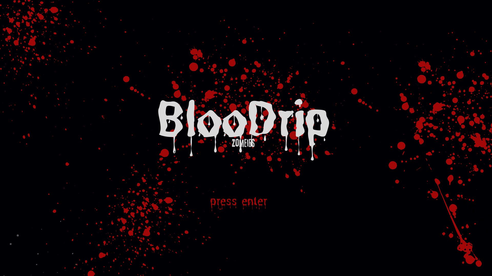
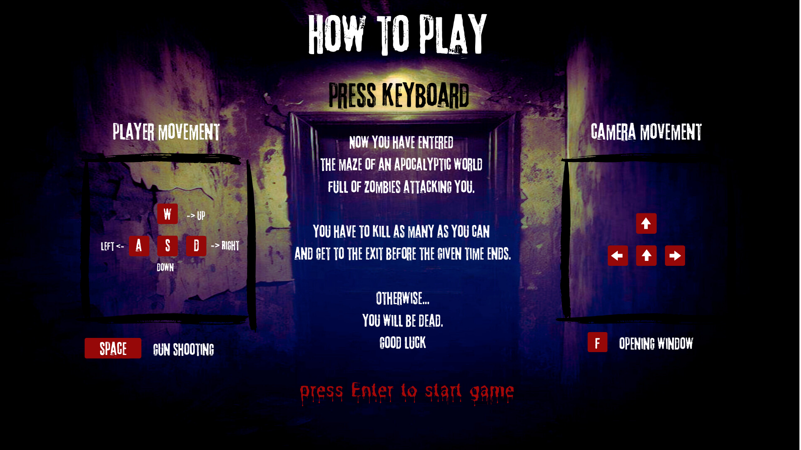

# Cub3D

This project is a survival-based maze game where you must navigate, fight zombies, and escape before time runs out.

## Table of Contents

1. [Introduction](#introduction)
2. [Features](#features)
3. [Installation](#installation)
4. [Usage](#usage)
5. [Dependencies & Tools](#dependencies--tools)
6. [Contributing](#contributing)
7. [License](#license)

---

## Introduction

### Game Title: BlooDrip

Step into an apocalyptic nightmare in *BlooDrip*, where survival is your only mission.

You find yourself trapped in a sprawling maze swarming with relentless zombies. Your only way out? Fight your way through, eliminate the undead, and locate the glowing exit door.

Here’s the twist: the exit door will only reveal itself halfway through the countdown. You’ll have a total of **120 seconds** to make your escape, but the glowing exit will only appear in the final **60 seconds**.

Are you ready to test your reflexes and strategy in the ultimate survival maze? Dive in and prove yourself!


<!-- 
 -->
---

### Start GIF


### Exit GIF


---

## Features

- **Animated Sprites**: Zombies, shooting mechanics, and blinking text bring the game to life.
- **Time Limitation**: The glowing exit door is revealed after half the countdown, adding tension to the gameplay.
- **Mouse and Arrowkey Control**: Intuitive aiming and smooth navigation for an immersive experience.
- **Interactive Doors**: Use doors as barriers to block zombies and strategize your escape.
- **Minimap**: A dynamic guide to help you explore and strategize your escape route.

---

## Installation

Follow these steps to install and run the game:

```bash
  //Clone the repository:
   git clone https://github.com/yourusername/yourproject.git

  //Compile the project:
    make fclean && make fc

  //Execute the game with a valid map:
    ./Cub3D maps/valid3.cub
```
Navigate using the keyboard and mouse to eliminate zombies, find the exit door, and escape within the time limit.  
Play the game and enjoy your adventure!


## Dependencies & Tools
The game utilizes the following technologies and tools:

- **Raycasting**: DDA Algorithm for efficient rendering.
- **MLX42**: Lightweight graphics library.
- **GLFW**: Window and input management.
- **Perf / Gmon**: Performance profiling and optimization tools.

## License
